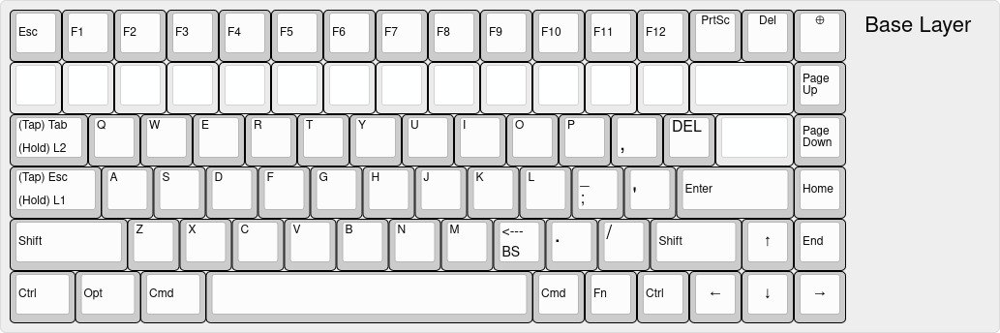
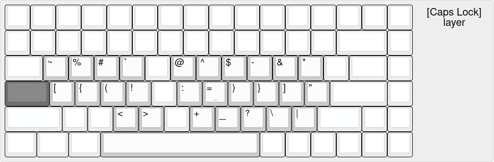
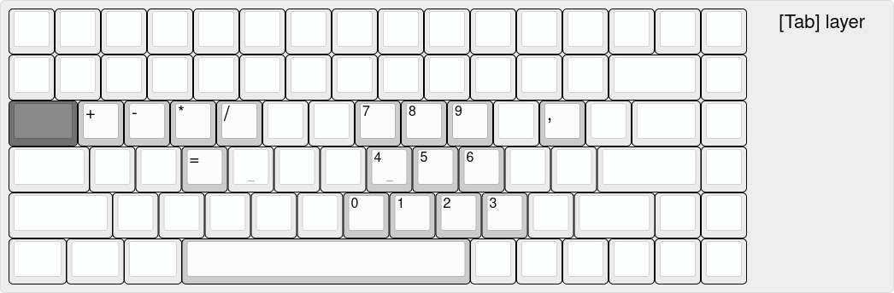
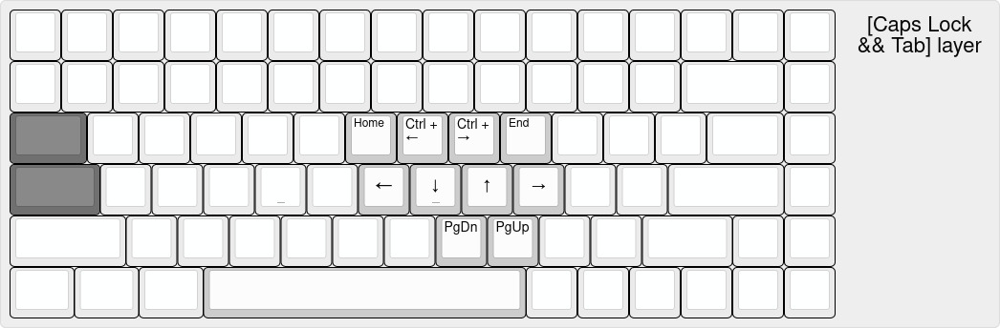

# KMonad Configuration

## QWERTY Enhanced

This configuration modifies the qwerty keyboard to make it more suitable for programming, and to minimise reaching for keys which displace the hands from regular typing positions

## Pre-requisites and Installation

### Linux Installation

- Clone this repo into ~/.config/kmonad
- Before installing, look for your correct keyboard device path in either `/dev/input/by-id` (for connected keyboards) or `/dev/input/by-path` (for in-built keyboards). Place the correct path under the `DEVICE_FILE_PATH` variable in ./.env.
  - Current laptop value: `/dev/input/by-path/pci-0000:06:00.4-usb-0:3:1.0-event-kbd`
  - Current desktop value: `/dev/input/by-id/usb-Keychron_Keychron_K3-event-kbd`
- Install KMonad (linux binary available in [kmonad releases](https://github.com/kmonad/kmonad/releases))
  - Chmod +x and put the binary in /usr/local/bin
  - Run `./install.sh`
- LOG OUT AND LOG BACK IN (OR RESTART)

### Windows Installation

#### Prerequisites
- Download KMonad for Windows from [kmonad releases](https://github.com/kmonad/kmonad/releases)
  - Place `kmonad.exe` in `C:\Program Files\kmonad\` (or note the custom location)
- Download or clone this repository to any location (e.g., `C:\Users\YourName\Documents\kmonad-config`)

#### Installation Steps

1. **Open PowerShell as Administrator**
   - Right-click Start → Windows PowerShell (Admin)

2. **Navigate to the repository directory**
   ```powershell
   cd C:\Users\YourName\Documents\kmonad-config
   ```

3. **Run the installation script**
   ```powershell
   .\install.ps1
   ```
   
   **If installing for a different user than your admin account:**
   ```powershell
   .\install.ps1 -TargetUser "YourNormalUsername"
   ```

4. **Follow the prompts:**
   - Choose target user (if not specified as parameter)
   - Enter service name suffix (or press Enter for "default")
   - Confirm KMonad path if different from default

5. **The script will:**
   - Create config directory in target user's AppData folder
   - Copy and configure the appropriate .kbd file
   - Attempt to create a Windows service (will fall back to scheduled task if service fails)
   - Start KMonad automatically

6. **RESTART your computer** for changes to take full effect

#### Management Commands

**If installed as a Service:**
```powershell
# Start service
Start-Service -Name "KMonad-default"

# Stop service
Stop-Service -Name "KMonad-default"

# Check status
Get-Service -Name "KMonad-default"

# Remove service (run as Admin)
cmd /c "sc.exe delete KMonad-default"
```

**If installed as a Scheduled Task:**
```powershell
# Start task
Start-ScheduledTask -TaskName "KMonad-default"

# Stop task
Stop-ScheduledTask -TaskName "KMonad-default"

# Check status
Get-ScheduledTask -TaskName "KMonad-default"

# Remove task
Unregister-ScheduledTask -TaskName "KMonad-default" -Confirm:$false
```

**Uninstall:**
```powershell
.\uninstall.ps1
```

#### Troubleshooting

**Config file not created:**
- If running as admin user different from target user, use: `.\install.ps1 -TargetUser "YourUsername"`
- Check that config templates exist in the repository directory

**Service won't start:**
- The script automatically falls back to scheduled task (which is often more reliable on Windows)
- Run `.\test-kmonad.ps1` to diagnose KMonad configuration issues
- Verify KMonad path is correct

**Permission/Access Denied:**
- Ensure PowerShell is running as Administrator
- Disable antivirus temporarily or add KMonad to exclusions
- Some antivirus software blocks low-level keyboard hooks

**KMonad not working after login:**
- Restart your computer (required for first installation)
- Check if scheduled task is enabled: `Get-ScheduledTask -TaskName "KMonad-default"`
- Manually start: `Start-ScheduledTask -TaskName "KMonad-default"`

**Multiple Installations:**
- You can install multiple configurations with different suffixes
- Example: `.\install.ps1 -TargetUser "User1"` then enter "gaming" as suffix
- This creates "KMonad-gaming" service/task with separate config

Bravo. Kmonad will now run on startup with the configuration defined in the appropriate config file

## Layers

### Base Layer



### CAPS layer (symbol layer)



### TAB layer (number layer)



### CAPS & TAB layer (movement layer)



## Note

If you need to edit the layer images in the future, JSON representation for https://keyboard-layout-editor.com/ is stored in `./layout_images/json/`
