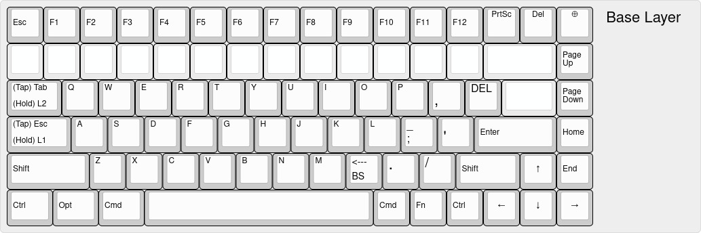
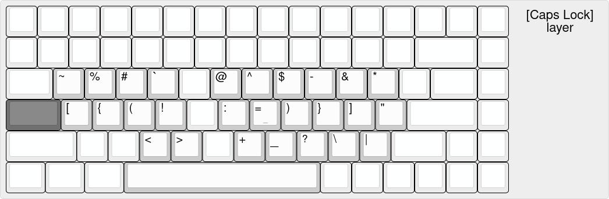
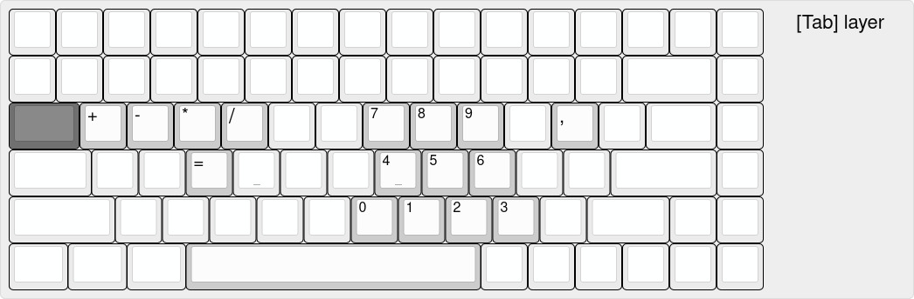
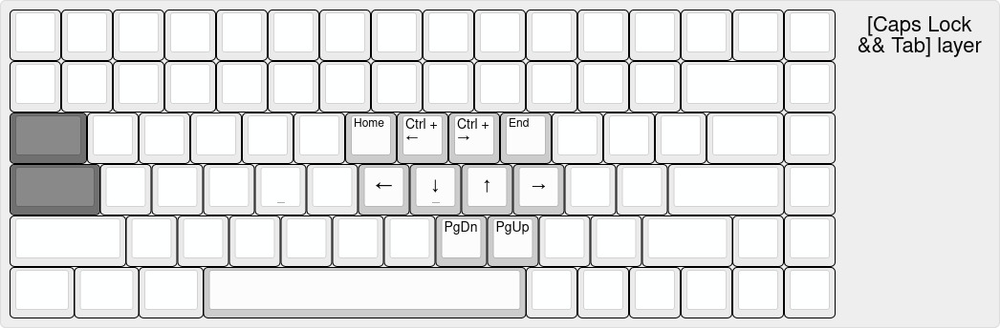

# Keyboard Remapper Configuration

## QWERTY Enhanced

This configuration modifies the qwerty keyboard to make it more suitable for programming, and to minimise reaching for keys which displace the hands from regular typing positions

Configurations are provided for:
- **KMonad** — Linux and Windows
- **Kanata** — macOS (required for macOS Tahoe+ where KMonad is incompatible)

## Pre-requisites and Installation

### macOS Installation (Kanata)

KMonad does not work on macOS Tahoe. This project uses [Kanata](https://github.com/jtroo/kanata) instead, which provides the same remapping functionality.

#### Prerequisites
- Install Kanata: `brew install kanata`
- Install [Karabiner-DriverKit-VirtualHIDDevice](https://github.com/pqrs-org/Karabiner-DriverKit-VirtualHIDDevice/releases) (v5+)
  - After installing, open the app once to activate the driver extension
  - Grant permissions when prompted in System Settings > Privacy & Security

#### Installation Steps

1. **Clone this repo** (or navigate to it)
2. **Run the install script:**
   ```bash
   ./install-macos.sh
   ```
3. The script will:
   - Validate the Kanata config
   - Copy config to `~/.config/kanata/kanata.kbd`
   - Create a launchd daemon for auto-start on boot
   - Start Kanata immediately

4. **Grant Input Monitoring permission** if prompted:
   - System Settings > Privacy & Security > Input Monitoring
   - Add your terminal app (or kanata)

#### Management

**Check status:**
```bash
sudo launchctl list | grep kanata
```

**View logs:**
```bash
cat /tmp/kanata.out.log
cat /tmp/kanata.err.log
```

**Restart after config changes:**
```bash
sudo launchctl unload /Library/LaunchDaemons/com.kanata.keyboard.plist
sudo launchctl load /Library/LaunchDaemons/com.kanata.keyboard.plist
```

**Uninstall:**
```bash
./uninstall-macos.sh
```

#### macOS Adaptation Notes

The movement layer (Caps+Tab held) uses macOS-native shortcuts:
- **Word navigation:** Alt (Option) + Left/Right (instead of Ctrl+Left/Right on Linux)
- **Line begin/end:** Cmd + Left/Right (instead of Home/End on Linux)
- Arrow keys and PageUp/PageDown remain unchanged

### Linux Installation

- Clone this repo into ~/.config/kmonad
- Before installing, look for your correct keyboard device path in either `/dev/input/by-id` (for connected keyboards) or `/dev/input/by-path` (for in-built keyboards). Place the correct path under the `DEVICE_FILE_PATH` variable in ./.env.
  - Current laptop value: `/dev/input/by-path/pci-0000:06:00.4-usb-0:3:1.0-event-kbd`
  - Current desktop value: `/dev/input/by-id/usb-Keychron_Keychron_K3-event-kbd`
- Install KMonad (linux binary available in [kmonad releases](https://github.com/kmonad/kmonad/releases))
  - Chmod +x and put the binary in /usr/local/bin
  - Run `./install.sh`
- LOG OUT AND LOG BACK IN (OR RESTART)

### Windows Installation

#### Prerequisites
- Download KMonad for Windows from [kmonad releases](https://github.com/kmonad/kmonad/releases)
  - Place `kmonad.exe` in `C:\Program Files\kmonad\` (or note the custom location)
- Download or clone this repository to any location (e.g., `C:\Users\YourName\Documents\kmonad-config`)

#### Installation Steps

1. **Open PowerShell** (no admin required)
   - Open PowerShell normally (no need to run as Administrator)

2. **Navigate to the repository directory**
   ```powershell
   cd C:\Users\YourName\Documents\kmonad-config
   ```
3. **Allow powershell script execution for your current session**
   ```powershell
   Set-ExecutionPolicy Bypass -Scope Process
   ```

4. **Run the installation script**
   ```powershell
   .\install.ps1
   ```

5. **Follow the prompts:**
   - Confirm KMonad path if different from default

6. **The script will:**
   - Automatically detect the current logged-in user
   - Create config directory in user's AppData folder (`%APPDATA%\kmonad`)
   - Copy and configure the appropriate .kbd file
   - Create a VBScript wrapper to run KMonad hidden in the background
   - Add a shortcut to the Windows Startup folder

7. **Start KMonad immediately** (or it will auto-start on next login):
   - Double-click the shortcut in: `%APPDATA%\Microsoft\Windows\Start Menu\Programs\Startup\KMonad.lnk`
   - Or run: `wscript.exe "%APPDATA%\kmonad\kmonad-hidden.vbs"`

#### Management

**Start KMonad manually:**
```powershell
wscript.exe "$env:APPDATA\kmonad\kmonad-hidden.vbs"
```

**Stop KMonad:**
```powershell
# Find KMonad process
Get-Process | Where-Object {$_.ProcessName -eq "kmonad"} | Stop-Process

# Or use Task Manager to end kmonad.exe
```

**Check if KMonad is running:**
```powershell
Get-Process | Where-Object {$_.ProcessName -eq "kmonad"}
```

**Uninstall:**
```powershell
.\uninstall.ps1
```

#### File Locations

After installation, you'll find:
- Config file: `%APPDATA%\kmonad\config.kbd`
- VBS wrapper: `%APPDATA%\kmonad\kmonad-hidden.vbs`
- Startup shortcut: `%APPDATA%\Microsoft\Windows\Start Menu\Programs\Startup\KMonad.lnk`

#### Troubleshooting

**Config file not created:**
- Ensure config templates (`config-windows.kbd` or `config.kbd`) exist in the repository directory
- Check file permissions in `%APPDATA%` folder

**KMonad path not found:**
- The script will prompt you to enter the correct path to `kmonad.exe`
- Common locations: `C:\Program Files\kmonad\kmonad.exe`, `%LOCALAPPDATA%\bin\kmonad.exe`

**KMonad not working after login:**
- Check if shortcut exists in Startup folder
- Manually run the VBS script to test: `wscript.exe "%APPDATA%\kmonad\kmonad-hidden.vbs"`
- Run `.\test-kmonad.ps1` to diagnose configuration issues

**Permission/Access Denied:**
- Some antivirus software blocks low-level keyboard hooks
- Add KMonad to antivirus exclusions or temporarily disable to test

**KMonad crashes or stops:**
- Check config file syntax: `%APPDATA%\kmonad\config.kbd`
- Look for error messages when running KMonad directly: `& "C:\Program Files\kmonad\kmonad.exe" "$env:APPDATA\kmonad\config.kbd"`

Bravo. Kmonad will now run on startup with the configuration defined in the appropriate config file

## Layers

### Base Layer



### CAPS layer (symbol layer)



### TAB layer (number layer)



### CAPS & TAB layer (movement layer)



## Note

If you need to edit the layer images in the future, JSON representation for https://keyboard-layout-editor.com/ is stored in `./layout_images/json/`
